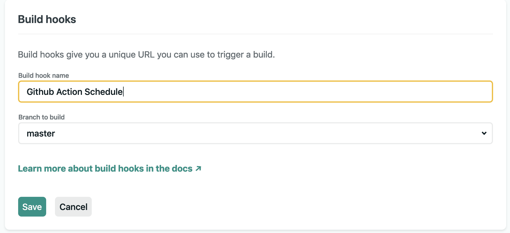
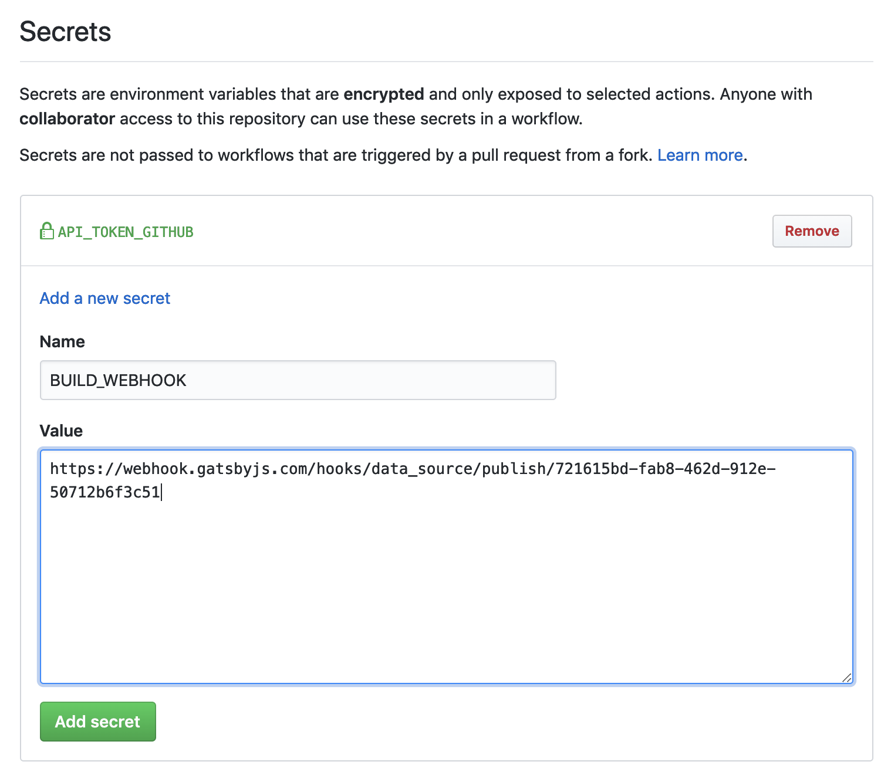

<p align="center">
  <a href="https://www.orlando.gov/Home">
    
  </a>
</p>
<h1 align="center">
  Orlando Service Relief
</h1>

## Forked

Fork of [gatsby-starter-service-relief](https://github.com/service-relief/gatsby-starter-service-relief) by Gatsbyjs.

## 🧐 What's inside? NEED TO UPDATE!

A quick look at the top-level files and directories you'll see in a Gatsby project.

    .
    ├── node_modules
    ├── src
    ├── .gitignore
    ├── .prettierrc
    ├── gatsby-browser.js
    ├── gatsby-config.js
    ├── gatsby-node.js
    ├── gatsby-ssr.js
    ├── LICENSE
    ├── package-lock.json
    ├── package.json
    └── README.md

1.  **`/node_modules`**: This directory contains all of the modules of code that your project depends on (npm packages) are automatically installed.

2.  **`/src`**: This directory will contain all of the code related to what you will see on the front-end of your site (what you see in the browser) such as your site header or a page template. `src` is a convention for “source code”.

3.  **`.gitignore`**: This file tells git which files it should not track / not maintain a version history for.

4.  **`.prettierrc`**: This is a configuration file for [Prettier](https://prettier.io/). Prettier is a tool to help keep the formatting of your code consistent.

5.  **`gatsby-browser.js`**: This file is where Gatsby expects to find any usage of the [Gatsby browser APIs](https://www.gatsbyjs.org/docs/browser-apis/) (if any). These allow customization/extension of default Gatsby settings affecting the browser.

6.  **`gatsby-config.js`**: This is the main configuration file for a Gatsby site. This is where you can specify information about your site (metadata) like the site title and description, which Gatsby plugins you’d like to include, etc. (Check out the [config docs](https://www.gatsbyjs.org/docs/gatsby-config/) for more detail).

7.  **`gatsby-node.js`**: This file is where Gatsby expects to find any usage of the [Gatsby Node APIs](https://www.gatsbyjs.org/docs/node-apis/) (if any). These allow customization/extension of default Gatsby settings affecting pieces of the site build process.

8.  **`gatsby-ssr.js`**: This file is where Gatsby expects to find any usage of the [Gatsby server-side rendering APIs](https://www.gatsbyjs.org/docs/ssr-apis/) (if any). These allow customization of default Gatsby settings affecting server-side rendering.

9.  **`LICENSE`**: Gatsby is licensed under the MIT license.

10. **`package-lock.json`** (See `package.json` below, first). This is an automatically generated file based on the exact versions of your npm dependencies that were installed for your project. **(You won’t change this file directly).**

11. **`package.json`**: A manifest file for Node.js projects, which includes things like metadata (the project’s name, author, etc). This manifest is how npm knows which packages to install for your project.

12. **`README.md`**: A text file containing useful reference information about your project

## Edited

@JovaniPink

Kick off your city's relief efforts as we all learn to cope with COVID-19 with this starter powered by Gatsby, Airtable, and community efforts.

## Overview

This project is aims to make it as easy as possible to launch and manage an index of resources in your city during the COVID-19 pandemic.

Using this template you can set up a service relief site without touching any code.

**1. Get Ready**

- Secure a domain name
- Create your accounts
  - Create Github Account
  - Create Netlify Account or Zeit Account
  - Create Airtable Account
- Add Github build webhook (optional)

**2. Set up data source**

- Set up Airtable
- Get ready to deploy
  - Get keys for env variables

**3. Deploy your site**

- Click Deploy button
- Connect to Airtable, set City/State
- Configure domain name

**4. Go Live**

- Add your site to the [directory](https://servicerelief.us/submit)
- Spread the word

## 1️⃣ Get Ready

### Secure a domain name

Generally we're using the pattern `citynameservicerelief.com` -- for example:

- `austinservicerelief.com`
- `seattleservicerelief.com`

### Create your accounts

First, you'll need to create a few accounts with free tiers from different software services.

#### 👉🏼 Create a GitHub Account

If you have a GitHub account, go ahead and [log in](https://github.com/join). If not, [sign up for an account](https://github.com/join).

#### 👉🏼 Create a Netlify Account

If you have a Netlify account, go ahead and [log in](https://app.netlify.com/signup). If not, [sign up for an account](https://github.com/join). (_Recommend logging in with GitHub._)

#### 👉🏼 Create an Airtable Account

If you have an Airtable account, go ahead and [log in](https://airtable.com/login). If not, [sign up for an account](https://airtable.com/signup).

## 2️⃣ Set up your data source

### Set up Airtable base

To set up Airtable, you can use a base template configured specifically for a service relief site.

👉🏼 [Open the template](https://airtable.com/addBaseFromShare/shroKwQGVsips8KI2?utm_source=airtable_shared_application) and click "Add base".


Then you should see several tiles that correspond to individual "Bases" that Airtable has set up for you. Look for "Service Relief Template".

👉🏼 Hover over the "Service Relief Template" tile, and click the "down" caret that appears. Replace the text **"Service Relief Template"** with something like **"Service Relief Austin"**. (_Use your city name_).


### Collect keys from Airtable

In order for your site to grab the data from your Airtable document, you'll need to collect **4 key values**.

Copy the following snippet into a text file.

```
AIRTABLE_API_KEY=key00000000000000
AIRTABLE_BASE_ID=app00000000000000
AIRTABLE_TABLE_NAME=tbl00000000000
AIRTABLE_EMBED_ID=shr0000000000000
```

#### Collect Airtable API key

> Your **API key** is secret, sort of like a key for a safe deposit box. Don't share it.

👉🏼 Visit your [Airtable account](https://airtable.com/account), and find the "API" section.

👉🏼 Click the "Generate API key" button.


👉🏼 Click on the dots to show your key, and copy it.


👉🏼 Paste the key in your text file as the value for `AIRTABLE_API_KEY`.

For example, if my key were `key123`, it would look like this:

```
AIRTABLE_API_KEY=key123
AIRTABLE_BASE_ID=app00000000000000
AIRTABLE_TABLE_NAME=tbl00000000000
AIRTABLE_EMBED_ID=shr0000000000000
```

#### Collect Airtable Base Id

👉🏼 Visit [the Airtable API page](https://airtable.com/api).

👉🏼 Click on the base you just created and renamed for your city.


👉🏼 Copy the base id found halfway down the page (highlighted in the gif above).

👉🏼 Paste the id in your text file as the value for `AIRTABLE_BASE_ID`.

For example, if my key were `app123`, it would look like this:

```
AIRTABLE_API_KEY=key123
AIRTABLE_BASE_ID=app123
AIRTABLE_TABLE_NAME=tbl00000000000
AIRTABLE_EMBED_ID=shr0000000000000
```

#### Collect Airtable Table Id

👉🏼 Visit the Airtable base you've created for your city by visiting the [Airtable homepage](https://airtable.com/) and then clicking the tile for your base.

You can find your table id in part of the url. After `https://airtable.com/`, copy everything before the next `/`. For example, in the following URL:

`https://airtable.com/tbl6QXLCylcd2ukYr/viw0PQQWbtAfxZ8qa`

The part you need would be `tbl6QXLCylcd2ukYr`.


👉🏼 Paste the table id in your text file as the value for `AIRTABLE_TABLE_NAME`.

For example, if my table id were `tbl123`, it would look like this:

```
AIRTABLE_API_KEY=key123
AIRTABLE_BASE_ID=app123
AIRTABLE_TABLE_NAME=tbl123
AIRTABLE_EMBED_ID=shr0000000000000
```

#### Collect Airtable Embed Id

👉🏼 Click the "Grid View" at the top left of your base.

👉🏼 Select "Submit a Fundraiser". This will take you to the form view, a submission form created automatically, which corresponds to your Airtable base.

👉🏼 Click "Share Form". You should see a link. Copy everything after `https://airtable.com/`.


👉🏼 Paste the embed id in your text file as the value for `AIRTABLE_EMBED_ID`.

For example, if my table id were `shr123`, it would look like this:

```
AIRTABLE_API_KEY=key123
AIRTABLE_BASE_ID=app123
AIRTABLE_TABLE_NAME=tbl123
AIRTABLE_EMBED_ID=shr123
```

With all four values collected, you're ready to set up the site.

## 3️⃣ Deploy Your Site

### Deploy to Netlify

> _Note: We plan to set up instructions for other providers eventually, as well._

👉🏼 Click the button below to begin the process of deploying to Netlify.

[](https://app.netlify.com/start/deploy?repository=https://github.com/service-relief/gatsby-starter-service-relief)

👉🏼 Click "Connect to GitHub". (_You should already be logged in, but if you're not, log in_).


👉🏼 For the repository name, use something like `service-relief-austin` (_using your city, of course_).

👉🏼 Use the text file with your four Airtable values to populate the prompts for API key, base id, table name, and embed id.

👉🏼 In the final two prompts, specify your city and state. (_We'll use this to personalize your site a bit_).


👉🏼 Click "Save and Deploy".

It will take a little while for your new site to build. You'll see the message "Site deploy in progress".

When the build is published, you'll see a live green link under the site title:


### Customize the site domain

You can set a custom domain in your Netlify site settings. From your site's main admin page on Netlify:

👉🏼 Click "Domain Settings".


👉🏼 Under "Custom Domains", click "Add Custom Domain".


From there, follow the steps to add your domain.

## 4️⃣ Go Live

### Last Steps

👉🏼 Be sure to clear out the data pre-loaded into the table you created in Airtable. Add in some organizations you know of in your city.

👉🏼 In that Airtable table, there's a column called `Approved`. In order to have any given entry show up on the deployed site, that column needs to be set to `Yes`.

👉🏼 For now, after events are added to Airtable, you need to trigger a manual deploy on Netlify.

- From the Netlify Overview page of your site, head to the `Deploys` page.
- Under the `Trigger deploy` dropdown on the right side of that page, select `Deploy sites`.
- After a couple of minutes, Netlify should deploy the latest changes. Refresh your site to double check.

### Build webhook

If you'd like to build out the site on some cadence instead of manually publishing, you can use the Github action and a build webhook to build on an automated schedule (set to two hours, by default).

First -- get a build webhook from Netlify.

1. Navigate to your site
1. Settings -> Build & Deploy
1. Continuous Deployment -> Add Build Hook (configure like below)



Next -- add this build webhook as a secret to your Github repository.

1. First, go to your repo and go to Settings
1. Next, go to "Secrets"
1. Add `BUILD_WEBHOOK` with the value we grabbed from Netlify

That's it! Now every two hours your site will deploy with any new approved submissions that have been submitted and vetted. Easy peasy lemon squeezy.



Note: If you're not interested in doing this, delete the `.github` folder in your cloned starter.
